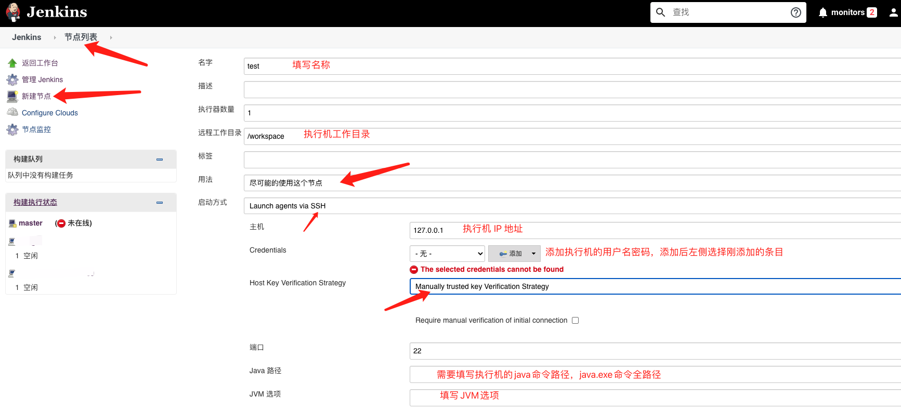
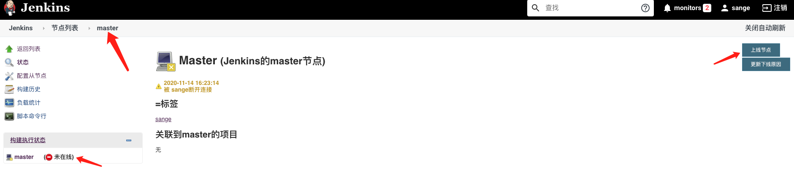
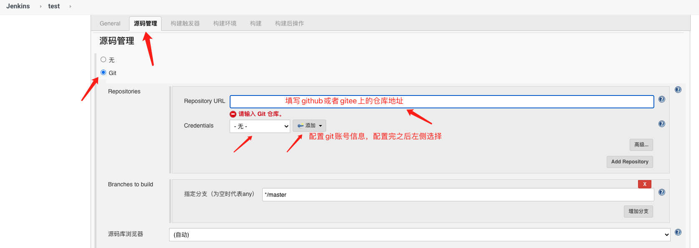
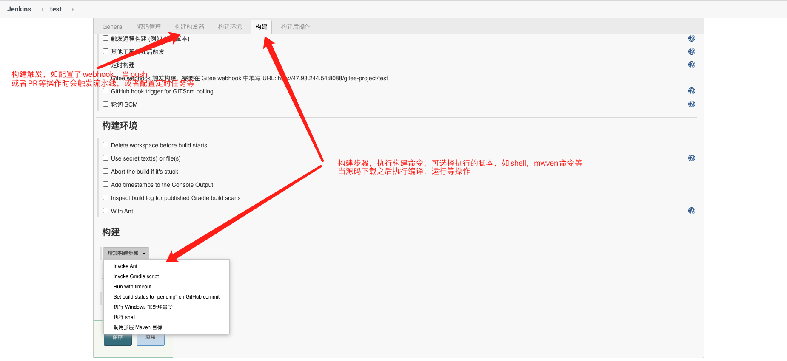
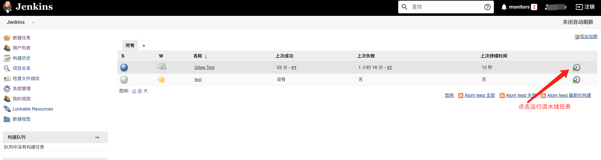
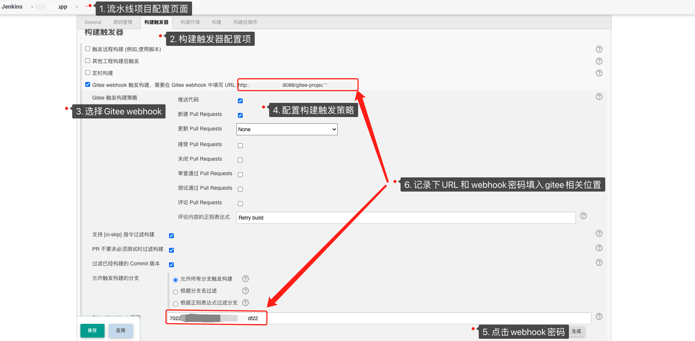
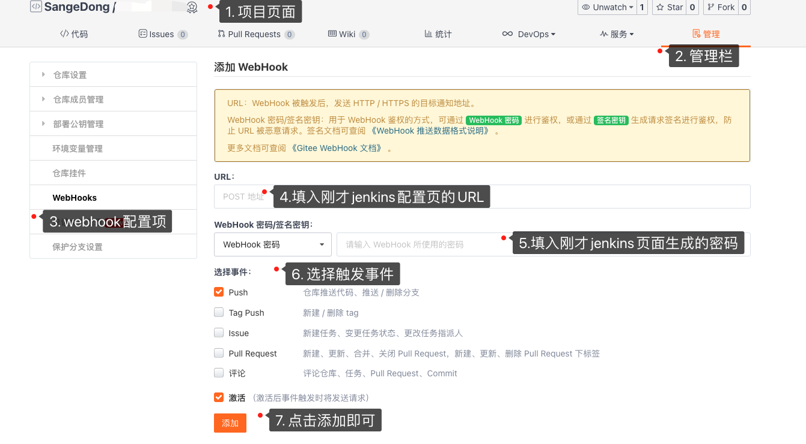
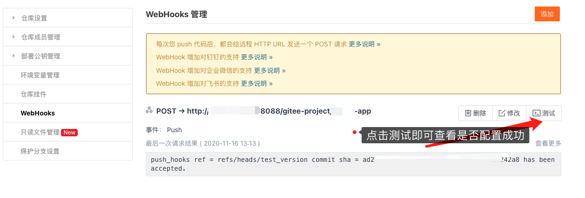

## Jenkins 安装

> Jenkins使用docker-compose来部署安装，配置如下

```shell
version: '3.7'
service:
  jenkins: 
  container_name: jenkins
  image: 'jenkinszh/jenkins-zh:lts'
  restart: always
  enviroment: 
    - TZ=Asia/Shanghai
  ports:
    - '8088:8080'
    - '50000:50000'
  volume: 
    - /opt/docker/jenkins/data:/var/jenkins_home
    - /var/run/docker.sock:/var/run/docker.sock
    - /usr/bin/docker:/usr/bin/docker
    - /usr/lib/x86_64-linux-gnu/libltdl.so.7:/usr/lib/x86_64-linux-gnu/libltdl.so.7
  privileged: true
  user: root
```

## Gitee 插件安装

1. 在线安装
   - 前往 Manage Jenkins -> Manage Plugins -> Available
   - 右侧 Filter 输入： Gitee
   - 下方可选列表中勾选 Gitee（如列表中不存在 Gitee，则点击 Check now 更新插件列表）
   - 点击 Download now and install after restart

2. 手动安装
   - 从 [release](https://gitee.com/oschina/Gitee-Jenkins-Plugin/releases) 列表中进入最新发行版，下载对应的 XXX.hpi 文件
   - 前往 Manage Jenkins -> Manage Plugins -> Advanced
   - Upload Plugin File 中选择刚才下载的 XXX.hpi 点击 Upload
   - 后续页面中勾选 Restart Jenkins when installation is complete and no jobs are running

## 插件配置

#### 添加 Gitee 链接配置

1. 前往 Jenkins -> Manage Jenkins -> Configure System -> Gitee Configuration -> Gitee connections
2. 在 `Connection name` 中输入 `Gitee` 或者你想要的名字
3. `Gitee host URL` 中输入 Gitee 完整 URL地址： `https://gitee.com` （Gitee 私有化客户输入部署的域名）
4. `Credentials` 中如还未配置 `Gitee APIV5` 私人令牌，点击 Add ` - > `Jenkins
   1. `Domain` 选择 `Global credentials`
   2. `Kind` 选择 `Gitee API Token`
   3. `Scope` 选择你需要的范围
   4. `Gitee API Token` 输入你的 Gitee 私人令牌，获取地址：https://gitee.com/profile/personal_access_tokens
   5. `ID`, `Descripiton` 中输入你想要的 ID 和描述即可。
5. `Credentials` 选择配置好的 Gitee APIV5 Token
6. 点击 `Advanced` ，可配置是否忽略 SSL 错误（视您的Jenkins环境是否支持），并可设置链接测超时时间（视您的网络环境而定）
7. 点击 `Test Connection` 测试链接是否成功，如失败请检查以上 3，5，6 步骤。

## 配置节点

1. 前往 Jenkins -> 系统管理 -> 节点管理 -> 新建节点，填写节点名称，选择固定节点，或着复制现有节点（如果有的话）
2. 上一步点击确定之后进入配置页面，如下



3. 配置完成后连接节点，当节点显示在线时即节点成功连上



## 创建流水线任务

1. 前往 Jenkins -> 新建任务， 填写任务名称后，选择创建自由风格的软件项目，点击确定，进入编辑页面
2. 源码配置，如下



3. 源码配置后简单的任务配置构建步骤即可，如下



4. 运行任务，如下启动



> 如无问题，流水线创建成功！

## 配置WebHook自动触发

1. Jenkins下webhook配置



2. Gitee 下Webhook 配置



3. 测试

