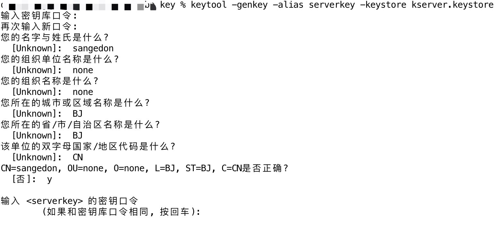
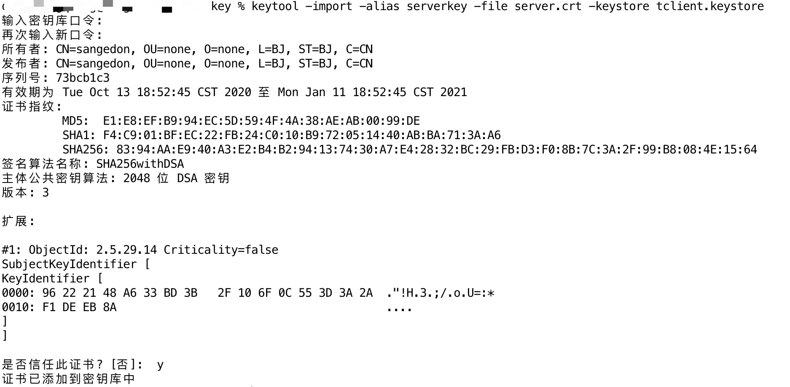
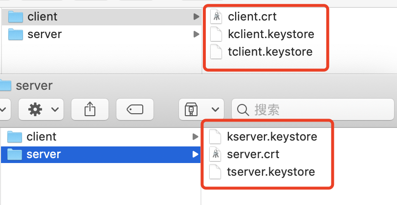

<!-- more -->

通常客户端连接服务器时会需要校验服务器是否`真实、正确`，如浏览器输入 `https://baidu.com`，这种单向确认服务器是否可靠的认证方式为**`单向认证`**，实际场景中，我们还经常会需要**同时**验证**服务器**和**客户端**连接的双方是否均为安全、可靠，即服务端为每个用户颁发一个**`唯一的、不公开`**的数字证书，客户端通过数字证书来访问服务器，此时，客户端和服务器的交互就是在通信协议上附加SSL协议，确保了 **1.** 服务器和客户端均为安全可靠，互相认可，**2.** 通信内容是加密的，网络嗅探工具无法获取明文数据，这种认证方式即为**`双向认证`**

- 下面将通过**`JSSE`**（Java Security Socket Extension）来模拟`Server` 和 `Client`的双向认证

注：`JSSE`是Sun为了解决在Internet上的安全通讯而推出的解决方案。它实现了SSL和TSL（传输层安全）协议。在`JSSE`中包含了数据加密，服务器验证，消息完整性和客户端验证等技术。通过使用`JSSE`，开发人员可以在客户端和服务器之间通过TCP/IP协议安全地传输数据。

### 证书准备

为了实现双向认证，Server 和 Client 端均需要如下两个信息文件（具体如下所列），在此使用`Java`自带的`keytool`命令生成证书文件

- KeyStore：服务器端（客户端）的私钥
- Trust KeyStore：保存服务器端（客户端）信任的授权证书

**1.** 生成服务器端私钥并导入到服务端KeyStore文件中，命令过程中需要填写一些内容，根据需求设置即可，如下图。

```shell
keytool -genkey -alias serverkey -keystore kserver.keystore

# 需设置内容
# keystore密码：123456
# 名字和姓氏：sangedon
# 组织单位名称：none
# 组织名称：none
# 城市或区域名称：BJ
# 州或省份名称：BJ
# 国家代码：CN
```

> **注：**serverkey私钥的密码，不填写和keystore的密码保持一致。这里千万注意，直接回车就行，不用修改密码。否则在后面的程序中无法直接应用这个私钥，会报错。



- 生成的`kserver.keystore`是提供给服务端使用，其中保存了服务端的私钥

**2.** 根据私钥，导出服务端证书

```shell
keytool -export -alias serverkey -keystore kserver.keystore -file server.crt
```


- `server.crt`就是服务端的证书

**3.** 将服务端证书，导入客户端Trust keyStore中

```shell
keytool -import -alias serverkey -file server.crt -keystore tclient.keystore
```




- `tclient.keystore`为客户端保存的受信任的证书

> 使用上述同样的方法，生成客户端私钥，客户端证书，并导入到服务端受信任证书列表，命令如下：
>
> ```shell
> keytool -genkey -alias clientkey -keystore kclient.keystore
> keytool -export -alias clientkey -keystore kclient.keystore -file client.crt
> keytool -import -alias clientkey -file client.crt -keystore tserver.keystore
> ```

- 生成如下证书文件



### 代码验证

- 客户端代码

```java
import java.io.BufferedInputStream;
import java.io.BufferedOutputStream;
import java.io.FileInputStream;
import java.io.IOException;
import java.io.InputStream;
import java.io.OutputStream;
import java.nio.charset.StandardCharsets;
import java.security.KeyStore;

import javax.net.ssl.KeyManagerFactory;
import javax.net.ssl.SSLContext;
import javax.net.ssl.SSLSocket;
import javax.net.ssl.TrustManagerFactory;

/**
 * SSL 连接客户端
 */
public class Client {
    private static final String HOST = "127.0.0.1";

    private static final int PORT = 8888;

    private static final String CLIENT_KEY_STORE_PASSWORD = "123456";

    private static final String CLIENT_TRUST_KEY_STORE_PASSWORD = "123456";

    private static final String KS_FILE = "client/kclient.keystore";

    private static final String TKS_FILE = "client/tclient.keystore";

    private SSLSocket sslSocket;

    public static void main(String[] args) {
        Client client = new Client();
        client.init();
        client.process();
    }

    /**
     * 建立连接处理
     */
    public void process() {
        if (sslSocket == null) {
            System.out.println("SSL 连接尚未建立");
            return;
        }
        try {
            InputStream is = sslSocket.getInputStream();
            OutputStream os = sslSocket.getOutputStream();
            BufferedInputStream bi = new BufferedInputStream(is);
            BufferedOutputStream bo = new BufferedOutputStream(os);
            bo.write("Client message".getBytes(StandardCharsets.UTF_8));
            bo.flush();
            byte[] bytes = new byte[1024];
            bi.read(bytes);
            System.out.println(new String(bytes, StandardCharsets.UTF_8));

            sslSocket.close();
        } catch (IOException e) {
            e.printStackTrace();
        }
    }

    /**
     * 创建SSL对话上下文，导入客户端秘钥keystore，导入客户端信任的keystore（服务端证书），初始化SSLSocket连接
     */
    public void init() {
        try {
            SSLContext sslContext = SSLContext.getInstance("SSL");
            KeyManagerFactory keyManagerFactory = KeyManagerFactory.getInstance("SunX509");
            TrustManagerFactory trustManagerFactory = TrustManagerFactory.getInstance("SunX509");
            KeyStore ks = KeyStore.getInstance("JKS");
            KeyStore tks = KeyStore.getInstance("JKS");
            ks.load(new FileInputStream(KS_FILE), CLIENT_KEY_STORE_PASSWORD.toCharArray());
            tks.load(new FileInputStream(TKS_FILE), CLIENT_TRUST_KEY_STORE_PASSWORD.toCharArray());
            keyManagerFactory.init(ks, CLIENT_KEY_STORE_PASSWORD.toCharArray());
            trustManagerFactory.init(tks);
            sslContext.init(keyManagerFactory.getKeyManagers(), trustManagerFactory.getTrustManagers(), null);
            sslSocket = (SSLSocket) sslContext.getSocketFactory().createSocket(HOST, PORT);
        } catch (Exception e) {
            e.printStackTrace();
        }
    }
}
```

- 服务端代码

```java
import java.io.BufferedInputStream;
import java.io.BufferedOutputStream;
import java.io.FileInputStream;
import java.io.InputStream;
import java.io.OutputStream;
import java.net.Socket;
import java.nio.charset.StandardCharsets;
import java.security.KeyStore;

import javax.net.ssl.KeyManagerFactory;
import javax.net.ssl.SSLContext;
import javax.net.ssl.SSLServerSocket;
import javax.net.ssl.TrustManagerFactory;

/**
 * SSL 连接服务端
 */
public class Server {
    private static final int PORT = 8888;

    private static final String SERVER_KEY_STORE_PASSWORD = "123456";

    private static final String SERVER_TRUST_KEY_STORE_PASSWORD = "123456";

    private static final String KS_FILE = "server/kserver.keystore";

    private static final String TKS_FILE = "server/tserver.keystore";

    private SSLServerSocket sslServerSocket;

    public static void main(String[] args) {
        Server server = new Server();
        server.init();
        server.start();
    }

    /**
     * 等待客户端连接，进行通信
     */
    public void start() {
        if (sslServerSocket == null) {
            System.out.println("SSL 连接尚未建立");
            return;
        }
        try {
            Socket socket = sslServerSocket.accept();
            InputStream is = socket.getInputStream();
            OutputStream os = socket.getOutputStream();
            BufferedInputStream bis = new BufferedInputStream(is);
            BufferedOutputStream bos = new BufferedOutputStream(os);
            byte[] bytes = new byte[1024];
            bis.read(bytes);
            System.out.println(new String(bytes, StandardCharsets.UTF_8));
            bos.write("Server accept".getBytes(StandardCharsets.UTF_8));
            bos.flush();
            socket.close();
        } catch (Exception e) {
            e.printStackTrace();
        }
    }

    /**
     * 创建SSL对话上下文，导入服务端秘钥keystore，导入服务端信任的keystore（客户端证书），初始化SSLServerSocket连接
     */
    public void init() {
        try {
            SSLContext sslContext = SSLContext.getInstance("SSL");
            KeyManagerFactory keyManagerFactory = KeyManagerFactory.getInstance("SunX509");
            TrustManagerFactory trustManagerFactory = TrustManagerFactory.getInstance("SunX509");
            KeyStore ks = KeyStore.getInstance("JKS");
            KeyStore tks = KeyStore.getInstance("JKS");
            ks.load(new FileInputStream(KS_FILE), SERVER_KEY_STORE_PASSWORD.toCharArray());
            tks.load(new FileInputStream(TKS_FILE), SERVER_TRUST_KEY_STORE_PASSWORD.toCharArray());
            keyManagerFactory.init(ks, SERVER_KEY_STORE_PASSWORD.toCharArray());
            trustManagerFactory.init(tks);
            sslContext.init(keyManagerFactory.getKeyManagers(), trustManagerFactory.getTrustManagers(), null);
            sslServerSocket = (SSLServerSocket) sslContext.getServerSocketFactory().createServerSocket(PORT);
            sslServerSocket.setNeedClientAuth(true);
        } catch (Exception e) {
            e.printStackTrace();
        }
    }

}
```

- 分别启动服务端和客户端即可验证