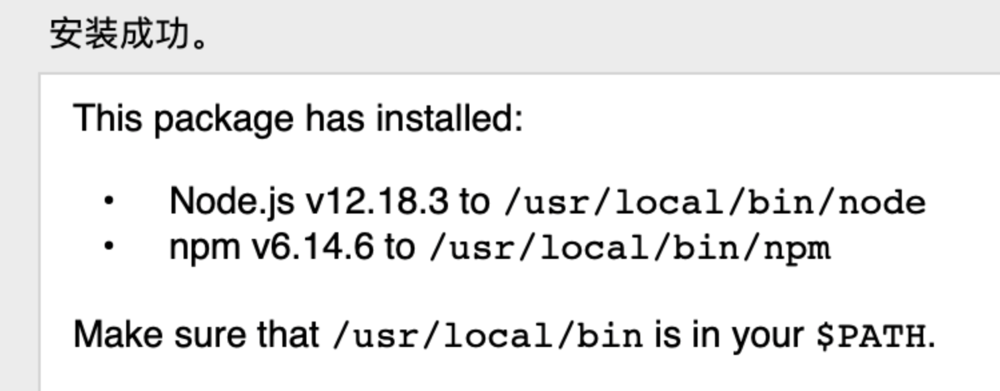

## 安装git

官网下载： https://www.git-scm.com/download/

版本：[2.27.0](https://sourceforge.net/projects/git-osx-installer/files/git-2.27.0-intel-universal-mavericks.dmg/download?use_mirror=autoselect)

安装：下载后双击 -> 下一步即可

配置 git 账号

```shell
git config user.name "sangedon"
git config user.email "sange.dong@outlook.com"
```


## 配置ssh

1 、检查.ssh文件夹是否存在

```shell
ls -al ~/.ssh
```

2、如果不存在新建.ssh文件平

```shell
mkdir ~/.ssh
```

3、生成KEY在命令行中输入，sange.dong@outlook.com

```shell
cd ~/.ssh
ssh-keygen -t rsa -C "sange.dong@outlook.com"
```

系统提示输入文件保存位置等信息，连续按三次回车即可，生成的SSH key文件的保存路径会在终端中给出：id_rsa      id_rsa.pub

4、查看公钥

```shell
cat id_rsa.pub
```


## 安装 JDK1.8

下载Mac版jdk网址：https://www.oracle.com/java/technologies/javase/javase-jdk8-downloads.html

oracle下载登陆账号：2696671285@qq.com / Oracle123

下载的版本：jdk-8u261-macosx-x64.dmg（1.8.0_261-b12）

安装： 双击一路向下即可

安装目录：/Library/Java/JavaVirtualMachines


## 安装 Maven

官网下载：https://maven.apache.org/download.cgi

版本：3.6.3

解压（安装）目录：/Users/dongliangqiong/Documents/sangedon/devtools/software

- 添加环境变量

```shell
# 创建.bash_profile文件
vim ~/.bash_profile

# 导出变量
export MAVEN_HOME=/Users/dongliangqiong/Documents/sangedon/devtools/software/apache-maven-3.6.3
export PATH=$PATH:$MAVEN_HOME/bin

# 使生效
source ~/.bash_profile
```

修改本地仓库路径：

修改文件：/Users/dongliangqiong/Documents/sangedon/devtools/software/apache-maven-3.6.3/conf/settings.xml 

修改内容：

```xml
<localRepository>/Users/dongliangqiong/Documents/sangedon/devtools/software/maven-repo</localRepository>
```


## 安装Node相关

- 安装NodeJS

  官网下载：https://nodejs.org/en/download/

  版本： Latest LTS Version: **12.18.3** (includes npm 6.14.6)

  下载文件：node-v12.18.3.pkg

  安装步骤：双击 -> 下一步 即可

  成功截图：

  


- 添加 淘宝npm镜像

  ```shell
  npm config set registry https://registry.npm.taobao.org
  ```

- 安装cnpm 代替 npm使用

  ```shell
  npm install -g cnpm --registry=https://registry.npm.taobao.org
  ```


- 安装hexo

  ```shell
  sudo npm install -g hexo
  ```


